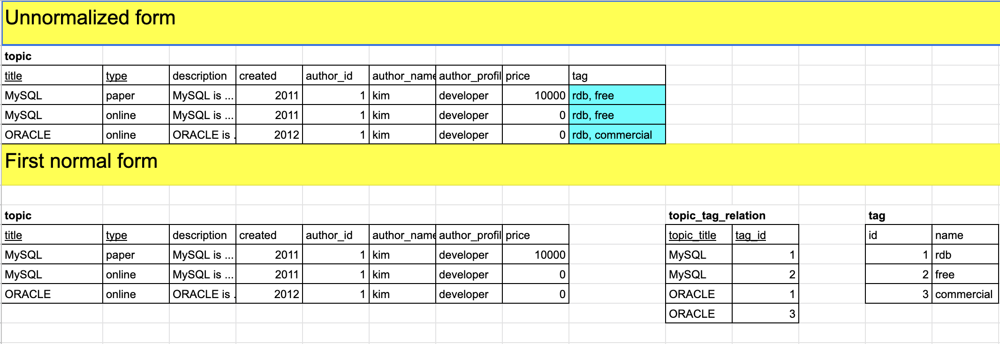
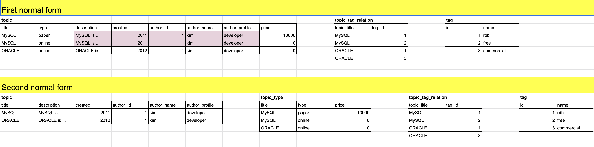
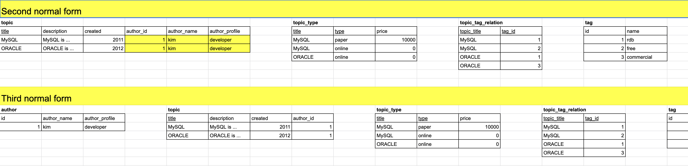

# 7장. 정규화

- 이상현상
- 함수 종속성
- 정규화

---

## 이상현상

두가지 이상의 정보가 한 릴레이션에 저장되면서 발생하는 이슈

- 직원(emp) 테이블에 부서명(dname)을 개체로 직접 갖기보다 부서(dept)테이블로 분리하고 pk(id)를 참조하도록 해야한다.

테이블에 데이터를 삽입할 때 부득이하게 NULL이 삽입되거나 삭제시 연쇄삭제 현상이 발생 또는 수정시 데이터 일관성이 훼손되는 현상

이상현상을 분류하면 다음과 같다.

- 삭제이상
  - 투플 삭제 시 같이 저장된 다른 정보까지 연쇄적으로 삭제되는 현상
- 삽입이상
  - 투플 삽입시 특정 속성에 해당하는 값이 없어 NULL 값을 입력해야 하는 현상
- 수정이상
  - 투플 수정시 중복된 데이터만 데이터의 일부만 수정하여 데이터의 불일치 문제가 일어나는 현상

 

## 함수 종속성

어떤 속성 A의 값을 알면 다른 속성 B의 값이 유일하게 정해지는 의존관계를 '`속성 A는 속성 B에 종속한다`' 라고 한다.

- A -> B
  - A는 B의 결정자.
  - B는 A의 종속 속성.
- e.g. 
  - 강좌이름 -> 강의실 : 강좌이름을 알면 강의실을 알 수 있다.
  - 학생 번호 -> 학생 이름 : 학생 번호를 알면 학생 이름을 알 수 있다.

함수 종속성을 판단할 때는 릴레이션의 데이터 뿐 아니라 속성이 갖는 의미까지 판단해야 한다.

- 학생 이름 -> 학과
- 위의 경우, 학생 이름만 알면 학과를 알 수 있어서 함수 종속성이라고 생각할 수 있으나 동명이인이 있다면 함수 종속성 규칙에 위배된다.

- 기본 키는 릴레이션의 모든 속성에 대한 결정자이다.

#### 함수 종속성 규칙

- 결합 규칙 (union) : `X -> Y` and `X -> Z` then `X -> YZ`
- 분해 법칙 (decomposition) : `X -> YZ` and `X -> Y` then `X -> Z`
- 유사이행 (pseudotransitivity) : `X -> Y` and `WY -> Z` then `WX -> Z`

 

## 정규화

이상현상은 릴레이션을 분해하여 제거한다. 분해된 릴레이션에 이상현상이 남아있다면 이상현상이 없어질때까지 분해한다.

릴레이션의 이상현상을 없애려면 함수 종속성을 분석하여 테이블을 단계적으로 분해한다.

#### 제 1 정규형

- 릴레이션 R의 모든 속성 값이 원자값이어야 한다. (=Atomic columns)
  - 속성값이 하나가 아니고 복수이면, 하나의 속성값만 갖도록 분리.

#### 제 2 정규형

- 릴레이션의 기본키가 복합키일때, 복합키의 일부분이 다른 속성의 결정자인지 여부를 판단하는 것
- 릴레이션이 제 1 정규형이면서 기본키가 아닌 속성이 기본키에 완전 함수 종속일때.
  - 완전 함수 종속 : 릴레이션 R의 속성 A, B가 A -> B 일 때 종속성 성립.
  - e.g. 사원(emp) 테이블에 부서(dept)테이블의 dname을 직접 가지면 안된다.

#### 제 3 정규형

- 릴레이션 R이 제 2정규형이면서 기본키가 아닌 속성이 기본키에 비이행적(non-transitive)으로 종속(직접 종속)할 때 제 3 정규형  

#### BCNF

- 릴레이션에 존재하는 함수 종속성에서 모든 결정자가 후보키이면 BCNF.

 

## 비정규화

<blockquote class="twitter-tweet">
&quot;정규화는 중복을 없애 디스크 공간을 절약하기 위한 것이었으며, 예전에는 디스크 공간이 비쌌기 때문입니다. 그러나 이제는 상황이 달라졌습니다. 쿼리에 걸리는 시간 최적화가 중요하며, 비정규화가 이를 달성하기 위한 직접적인 방법입니다.&quot;<a href="https://t.co/IPtGQ7mmr0">https://t.co/IPtGQ7mmr0</a>
&mdash; @if1live@planet.moe ⚡️ (@if1live) <a href="https://twitter.com/if1live/status/1181155806881841152?ref_src=twsrc%5Etfw">October 7, 2019</a></blockquote>  

 

 

---

# 생활코딩 - 정규화

sample sheet : https://docs.google.com/spreadsheets/d/1zmN7qQYjKGkQW0aSKFQxEJ-yLVXYM27AHgnsybJGvFM/edit#gid=251854387

## 제 1 정규화

Atomic Columns

- 모든 컬럼은 하나의 값만 유지해야 한다.
- 투플들이 tag 컬럼의 속성을 2개씩 갖으므로 Atomic하다고 볼 수 없다.
- tag 컬럼을 테이블로 분리하고, topic과 tag를 연결하는 테이블을 하나 더 분리하면 tag 컬럼을 Atomic Column으로 만들수 있다.

link : https://youtu.be/FYDHJbIwm5Y

 

## 제 2 정규화

No partial dependency (부분 종속성)

- `description`, `created`,`author_id`, `author_name`,`author_porfile`, 컬럼은 title 컬럼에 `부분종속`되고 있다.
- type과 price를 따로 떼서 분리하면 (`topic_type`), 부분종속성을 제거할 수 있다.

link : https://youtu.be/7meeyknh7yE

 

## 제 3 정규화

No transitive dependencies (이행적 종속성)

- `author_id`는 `title`에 의존, `author_name`,` author_profile`은 `author_id`를 의존.
  - `title` <- `author_id`
  - `author_id` <- `author_name,` `author_profile` 
- `author` 테이블을 분리하고 의존갖는 컬럼들이 이를 참조하도록 한다.

link : https://youtu.be/aS9FoCNlt3o

 
