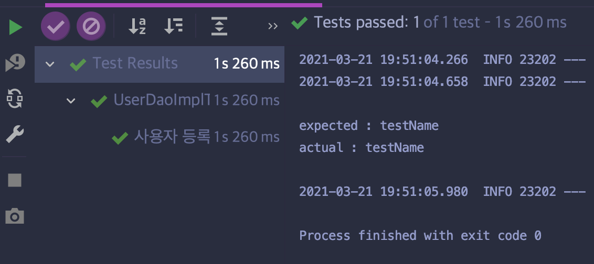

# 2장. 테스트

테스트란, 개발자가 의도한 대로 코드가 동작하는지 확인하기 위한 작업이다. 만약 이 결과가 의도대로 나오지 않는 경우에 코드 또는 설계에 결함이 있을수 있다. 이 때 디버깅을 통해 결함을 제거하고 테스트가 성공하면 결함이 제거됐다는 확신을 얻을 수 있다.

### UI 환경에서의 테스트의 문제

로그인 기능을 검증하기 위해서 브라우저로 테스트한다고 가정하면 로그인 기능 하나를 테스트하기위해서 전체 웹 서버를 동작시키고, 아이디와 패스워드를 폼에 입력해서 로그인 성공, 또는 로그인 실패가 되는지를 확인해야 한다. 한 번의 케이스를 할 때마다 로그인과 로그아웃을 반복해야 하는데 이런 테스트는 매우 비효율적일뿐더러 오히려 다른 에러를 발견이라도 하면 원래 검증하려고 했던 로그인 기능을 테스트하지 못할수도 있다.

### 작은 단위의 테스트

테스트의 단위는 작을 수록 좋다고 한다. 결합도가 복잡할 경우, 테스트하려는 대상이 모호해질수 있으므로 최대한 작게 쪼개어 단위 테스트를 하는게 테스트 대상에만 집중할 수 있다. 이를 **단위 테스트(Unit Test)** 라고 한다.

### JUnit

JUnit은 스프링에서 제공하는 테스트 프레임워크이다.

모든 테스트 메서드는 `main()`처럼 각각 제어권을 갖고 있으며, 독립적으로 실행하여 테스트를 진행할 수 있다. <u>애노테이션으로 `@Test`만 붙히면 된다.</u>

~~~java
public class UserDaoTest {
   @Test
   public void addAndGet() throws SQLException {
      ApplicationContext context 
         = new ClassPathXmlApplicationContext("");
   }
}
~~~

### 예외 테스트

예외가 정상적으로 throw 되는지 확인할 수 있다.

~~~java
@Test(expected=EmptyResultDataAccessException.class)
public void getUserFailure() throws SQLException {
   ApplicationContext context = new GenericXmlApplicationContext("applicationContext.xml");
  
   UserDao dao = context.getBean("userDao", UserDao.class);
   dao.deleteAll();
   assertThat(dao.getCount(), is(0));
}
~~~

이 테스트 메서드를 실행했을때, `EmptyResultDataAccessException` 이 발생한다면 테스트가 성공할 것이고, 그렇지 않다면 성공하지 않을것이다.

예외가 정상적으로 발생하는지 테스트하는 방법은 아래의 방법도 있다.

~~~java
@Test
@DisplayName("StringIndexOutOfBoundsException 발생하는 테스트")
void 요구사항3_2() {
   String data = "abc";
   assertThatThrownBy(() -> {
      char result = data.charAt(4);
      assertThat(result).isEqualTo('a');
   }).isInstanceOf(StringIndexOutOfBoundsException.class);
}
~~~

[AssertJ](https://www.baeldung.com/assertj-exception-assertion) 라는 테스트 라이브러리의 테스트 메서드 `assertThatThrownBy()`를 사용한 예제코드이다.

### 테스트 주도개발(TDD, Test Driven Development)

테스트를 먼저 하고, 테스트가 성공하면 프로덕션 코드로 이어가는 개발 방식을 이야기한다.

> 실패한 테스트를 성공시키기 위한 목적이 아닌 코드는 만들지 않는다.
>
> TDD 기본원칙

TDD는 작업의 주기를 짧게 가져가는게 중요하다고 한다. 그러다보니 TDD를 하다보면 자연스럽게 단위 테스트를 하게된다.

## User Service 테스트 코드 작성하기

현재 진행중인 프로젝트는 Spring Boot는 Test 의존성을 갖고있으므로 특별한 라이브러리를 추가하지 않아도 JUnit을 사용할 수 있다.

JUnit을 이용하여 User를 등록하고, 삭제하는 테스트를 진행했다. 

DAO나 컨트롤러가 아닌 서비스를 테스트 대상으로 선택한 이유는 컨트롤러는 페이지 View와 통신하는 역할을 하는데 현재 진행중인 프로젝트에서는 View를 구현하지 않았으므로 컨트롤러 보다 위의 MVC 아키텍쳐에서 Model에 해당하는 부분에 대한 테스트가 필요해보였다.

DB와 통신하는 DAO보다는 실제 서비스에 대한 테스트가 더 유효할것이라는 생각을 했다. 

사용자 등록 **테스트 목적은 DB와 직접 통신해서 기대했던 결과가 진행되는지**를 알아보게 된다.

~~~java
import static org.junit.jupiter.api.Assertions.assertEquals;

@SpringBootTest
class UserServiceImplTest {
  
   @Autowired
   UserService userService;

   @Test
   @DisplayName("사용자 등록 테스트")
   void createUser() {
      // given
      User user = new User();
      user.setId("testId");
      user.setName("testName");
      user.setPassword("testPw");

      // when
      userService.createUser(user);

      // then
      String expected = user.getName();
      String actual = userService.getUser(user.getId()).getName();

      System.out.println("\nexpected : "+expected);
      System.out.println("actual : "+actual+"\n");

      assertEquals(actual,expected);
   }
}

~~~

테스트에서 사용한 어노테이션으로 `@SpringBootTest`를 사용했는데, 이 애노테이션을 테스트 대상 클래스에 작성해야 단위 테스트에서도 웹 서버가 실행되면서 클래스 내부에서 선언한 빈 객체들을 스프링에 주입해서 테스트를 진행할 수 있다.

그럼 단위 테스트를 진행하는 순간 스프링부트 웹 서버가 동작하면서 `@Autowired`로 선언한 객체들을 주입받는다. 여기서 주입받은 Bean으로 `UserService` 인스턴스를 사용할 수 있게된다.

단위 테스트 대상은 `@Test`가 붙은 메서드이다.

테스트는 Martin Fowler가 [언급](https://martinfowler.com/bliki/GivenWhenThen.html)한 given-when-then 으로 작성했다. 

- **given**
   - 테스트를 위해 준비하는 파트이다.
   - 테스트의 대상에 파라미터가 필요하다면, 그 파라미터에 들어갈 인자를 정의하는 파트이다.
- **when**
   - 테스트하고자 하는 대상의 파트이다.
- **then**
   - JUnit, AssertJ와 같은 테스트 라이브러리를 이용하여 실제 테스트를 하는 역할이다.
   - 기대하는 객체(`expected`)와 실제 객체간 비교(`actual`)를 진행한다. 

위의 코드를 실행한 단위 테스트의 결과는 다음과 같다.

`@DisplayName` 애노테이션은 테스트 이름을 작성해서 테스트 결과에서 어떤 테스트를 진행했는지 보여주는 역할을 수행한다.

 