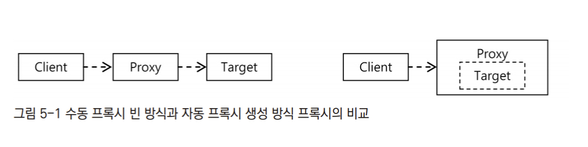

# 5장 AOP와 LTW

## 5.1 애스펙트 AOP

-  AOP는 모듈화된 부가기능(Advice)와 적용대상(Pointcut)의 조합을 통해 오브젝트에 산재해서 나타나는 공통적인 기능을 손쉽게 개발하고 관리할 수 있는 기술
-  프록시 방식의 AOP는 객체지향 디자인 패턴의 데코레이터 패턴 / 프록시 패턴을 응용하여 기존 코드에 영향을 주지 않은채로 부가기능을 타겟에 제공하는 OOP로부터 출발, 여기에 Pointcut이라는 적용 대상 선택 기법과 자동 프록시 생성이라는 적용 기법까지 접목하면, AOP라 부를 수 있는 효과적인 부가기능 모듈화가 가능

 

### 프록시 기반 AOP 개발 스타일의 종류와 특징

-  ##### AOP 인터페이스 구현과 \<Bean> 등록을 이용하는 방법

-  ##### AOP 인터페이스 구현과 aop 네임스페이스의 \<aop:advisor> 태그 이용 방법

-  ##### 임의의 자바 클래스와 aop 네임스페이스의 \<aop:aspect>를 이용하는 방법

-  ##### @AspectJ 애노테이션을 이용한 Aspect 개발 방법

   -  `@AspectJ` 문법은 사용하지만, AspectJ AOP를 사용하는건 아니다.

-  위의 4가지 방법중 첫 두가지 방법은 AOP 인터페이스를 구현하는 방식. 

   -  스프링 AOP의 개념인 어드바이저를 이용한다.

-  나머지 두가지 방법은 인터페이스 구현 대신 관례와 애노테이션을 사용하는 방식.

   -  AspectJ의 Aspect라는 개념을 사용 

 

### 자동 프록시 생성기와 프록시 빈

-  스프링의 프록시 개념은 데코레이터 패턴에서 나온 것이며, 동작원리는 JDK 다이내믹 프록시와 DI를 이용한다.

-  Client는 Target을 DI 받아 사용하는 관계여야 한다.
-  Client와 Target의 코드에 전혀 영향을 주지 않으면서 Client가 Target을 이용하는 과정에서 부가기능을 제공하기 위함이다.
-  따라서 Client가 Target이라는 구체 클래스를 직접 의존하는 대신 Target이 구현하는 인터페이스를 이용하여 의존하는 관계로 만들어야 한다.

~~~java
public class Client {
  @Autowired Interface intf;
  ...
}

interface Interface {...}

public class Target implements Interface {...}
~~~

-  그리고 `Interface`를 구현하는 Proxy 클래스를 생성하면 된다.

~~~java
public class Proxy implements Interface {
  private Interface next;
  public void setNext(Interface next) {
    this.next = next;
  }
}
~~~

-  Proxy가 `Interface`를 구현했으므로 Client 에 주입이 가능해졌다.
-  그러나 `Interface`를 구현한 두 개의 빈이 만들어지므로 `@Autowired`에 의한 자동 빈 선택이 불가능해졌다.
-  따라서 스프링은 자동 프록시 생성기를 이용하여 컨테이너 초기화 중에 만들어진 빈을 바꿔치기하여 프록시 빈을 자동으로 등록해준다.
-  이 자동 프록시 생성기가 바로 스프링의 프록시 기반 AOP 핵심 동작원리다.
   -  
   -  수동으로 프록시 빈을 등록하는 방법이 Client와 Target 사이에 Proxy가 끼어드는 관계이다.
   -  반면 자동 프록시 생성기는 프록시 빈을 별도로 추가하고 DI 설정만 바꿔주는게 아니라 프록시를 적용할 대상 자체를 아예 자신이 포장하여 그 대상 빈처럼 동작한다.
   -  자동 프록시 생성기가 만들어지는 프록시는 새로운 빈으로 추가되는 것이 아니라 AOP 대상 타깃 빈을 대체

 

### 프록시 생성기의 특징

-  AOP 적용은 @Autowired의 타입에 의한 의존관계 설정에 문제를 일으키지 않는다.
-  AOP 적용은 다른 빈들이 Target 오브젝트에 직업 의존하지 못하게 한다.

 

### 프록시의 종류

-  인터페이스를 구현한 프록시
-  클래스를 이용한 프록시
   -  아무런 인터페이스도 구현하지 않은 타깃 클래스에 AOP를 적용하는 것
   -  강제로 클래스 프록시를 만들도록 설정하는 것.
      -  `<aop:config>`의 `proxy-target-class="true"` 로 지정

 

### @AspectJ AOP

-  여러 객체에 공통으로 적용되는 공통 관심 사항을 Aspect라 한다.
-  Aspect는 OOP의 클래스와 비슷한 개념
-  Aspect는 하나 이상의 Pointcut과 Advice로 구성
-  `@AspectJ`는 Aspect를 자바 클래스와, 메소드 그리고 애노테이션을 이용하여 정의하는 방법을 가리킨다.

#### @Aspect 클래스와 구성요소

-  클래스를 Aspect로 사용하려면 빈으로 등록해야하는데, `@Component`를 붙이면 자동스캔을 통해 빈으로 등록된다.
-  빈으로 등록된 클래스 중 클래스 레벨에 `@Aspect`를 붙이면 모두 Aspect로 등록해준다.

### 포인트컷: @Pointcut

-  포인트컷은 `@Pointcut` 애노테이션이 달린 메소드를 이용하여 선언한다.
-  하나의 `@Aspect` 클래스 안에 여러개의 포인트컷을 선언할 수 있다.
-  이 메소드를 통해 정의되는 포인트컷의 이름은 메소드 이름과 동일하게 등록된다.

~~~java
@Pointcut("execution(* hello(...))")
private void all() { }
~~~

### 포인트컷 메소드와 애노테이션

-  포인트컷 메소드의 리턴 타입은 반드시 `void`이다.
-  `@Pointcut`으로 정의된 포인트컷은 다른 포인트컷 또는 어드바이스에서 사용된다.
-  Pointcut은 적용할 Joinpoint를 선별하는 것이다.
-  Joinpoint는 Advice로 정의된 부가기능을 적용할 수 있는 위치이다.

### 포인트컷 지시자

-  ##### execution()

   -  가장 대표적이고 강력한 Pointcut 지시자.

~~~java
execution(* *(...))
~~~

-  ##### within()

   -  타입 패턴만을 이용하여 Joinpoint 메소드를 선택

~~~java
@Pointcut(within("com.epril.myproject.dao..*"))
private void daoLayer() { }

@Pointcut(within("com.epril.myproject.service..*"))
private void serviceLayer() { }

@Pointcut(within("com.epril.myproject.web..*"))
private void webLayer() { }
~~~

-  ##### this, target

   -  여러 개의 타입을 고를 수 있는 타입 패턴이 아니라 하나의 타입을 지정하는 방식
   -  this는 빈 오브젝트의 타입을 비교, target은 타깃 오브젝트 타입과 비교한다.
   -  스프링의 자동 프록시 생성기는 타깃 빈 오브젝트를 프록시 오브젝트로 변경한다.
   -  this와 target은 포인트컷 파라미터를 이용하여 정의하고 어드바이스에 바인딩할 용도로 쓰인다.

-  ##### args

   -  메소드의 파라미터 타입만을 이용해 Pointcut을 설정할 때 사용
   -  `args()`
      -  파라미터가 없는 메소드만을 선별하는 Pointcut 표현식
   -  `args(String)`
      -  파라미터 개수가 하나면서 String 타입인 것만 선택하는 표현식
   -  `args(String, ...)`
      -  첫번째 파라미터가 String 타입이며, 파라미터 갯수가 하나 이상인것을 모두 선택하는 표현식
   -  `args(String, *)`
      -  첫번째 타입은 String, 두번째 타입부터는 모든 타입을 허용하는 Pointcut 표현식

-  ##### @target

   -  타깃 오브젝트에 특정 애노테이션이 부여된 것을 선정하는 지시자

   -  타깃 오브젝트에서 @Controller 애노테이션이 부여된 빈만 선정하는 Pointcut 표현식

   -  ~~~java
      @target(org.springframework.stereotype.Controller)
      ~~~

-  ##### @within

   -  타깃 오브젝트의 클래스에 특정 애노테이션이 부여된것을 선정하는 지시자

-  ##### @args

   -  파라미터 오브젝트에 지정된 애노테이션이 부여되어 있는 경우 선정 대상

   -  ~~~java
      // @DomainObject라는 애노테이션이 붙은 단일 파라미터를 갖는 메소드를 선택하는 표현식
      @args(com.epril.myproject.annotation.DomainObject)
      ~~~

-  ##### @annotation

   -  Joinpoint 메소드에 특정 애노테이션이 있는 것만 선정하는 지시자

   -  ~~~java
      // 메소드 레벨에 @Transactionl을 가진 메소드를 선정하는 표현식
      @annotation(org.springframework.transaction.annotation.Transactional)
      ~~~

-  ##### bean

   -  빈 이름 또는 아이디를 이용하여 선정하는 지시자

   -  AspectJ가 아니라 Spring AOP의 전용 지시자

   -  ~~~java
      // Service로 끝나는 모든 빈 이름을 가진 빈 오브젝트를 선정하는 표현식
      bean(*Service)
      ~~~

-  ##### &&

   -  두 개의 Pointcut 또는 지시자를 AND 조건으로 결합

   -  ~~~java
      // args 지시자의 조건을 모두 만족하는 대상을 선정하는 표현식
      within(com.epril.myproject.service..*) && args(java.io.Serializable)
      ~~~

-  ##### || , !

   -  두 가지 지시자 도는 Pointcut의 대상을 모두 포함하는 표현식

   -  `!`는 NOT 조건

   -  ~~~java
      // DAO 계층과 legacy.dao 패키지의 모든 타입을 포함하는 Pointcut을 정의하는 예
      daoLayer() || within(com.epril.legacy.dao..*)
      ~~~

 

### 어드바이스: @Before, @AfterReturning, @AfterThrowing, @After, @Around

-  애노테이션이 붙은 메소드를 이용하여 정의
-  5가지 어드바이스를 사용할 수 있다.
-  포인트컷과 마찬가지로 어드바이스는 하나 이상을 정의할 수 있다.

어드바이스 메소드

~~~java
@Around("all()")
public Object printParametersAndReturnVal(ProceedingJoingPoint pjp) throws Throwable {
  ...
  Object ret = pjp.proceed();
  ...
}
~~~

어드바이스에서 정의하는 포인트컷

~~~java
@Around("execution(* *(..))")
public Object printParametersAndReturnVal(ProceedingJoinPoint pjp) throws Throwable { }
~~~

-  ##### @Around

   -  @Around는 프록시를 통해서 타깃 오브젝트의 메소드가 호출되는 전 과정을 모두 담을 수 있는 어드바이스

   -  ~~~java
      @Around("myPointcut()")
      public Object doNothing(ProceedingJoinPoint pjp) throws Throwable {
        Object ret = pjp.proceed();
        return ret;
      }
      ~~~

   -  파라미터로 `ProceedingJoinPoint` 타입의 오브젝트를 받으며, 아무 부가기능 없이 타깃 오브젝트를 호출하고 그 결과를 클라이언트에 돌려주는 단순한 `@Around` 코드이다.

   -  `proceed()`는 클라이언트가 보낸 파라미터를 그대로 사용하여 타깃 오브젝트의 메소드를 호출하고 그 결과를 반환

-  ##### @Before

   -  타깃 오브젝트의 메소드가 실행되기 전 사용되는 어드바이스.

   -  ~~~java
      // 타깃오브젝트 메소드의 이름과 파라미터를 출력하는 어드바이스 코드
      @Before("myPointcut()")
      public void logJoinPoint(JoinPoint jp) {
        System.out.println(jp.getSignature().getDeclaringTypeName());
        System.out.println(jp.getSignature().getName());
        for(Object arg : jp.getArgs()) {
          System.out.println(arg);
        }
      }
      ~~~

-  ##### @AfterReturning

   -  타깃 오브젝트의 메소드가 실행을 마친 뒤에 실행되는 어드바이스

   -  ~~~java
      // 타깃 오브젝트 메소드의 리턴 값을 ret 파라미터로 제공받는 @AfterReturning 어드바이스 코드
      @AfterReturning(pointcut="myPointcut()", returning="ret")
      public void logReturnValue(Object ret) { }
      ~~~

-  ##### @AfterThrowing

   -  타깃 오브젝트의 메소드를 호출했을 때 예외가 발생하면 실행되는 어드바이스

   -  모든 예외를 전달받기 위해서는 `Throwable`로 파라미터 타입을 지정

   -  ~~~java
      // DAO 계층의 오브젝트를 호출해서 DataAccessException이 발생할 경우, 예외 오브젝트를 파라밈터로 호출되는 어드바이스
      @AfterThrowing(pointcut="daoLayer()", throwing="ex")
      public void logDAException(DataAccessException ex) { }
      ~~~

-  ##### @After

   -  메소드 실행이 정상 종료됐을때와 예외가 발생했을때 모두 실행되는 어드바이스.
   -  `finally` 키워드와 비슷한 역할

 

### @AspectJ를 이용한 AOP의 학습 방법과 적용 전략

-  AOP는 항상 단순하고 명료하게 접근해야 한다.
-  객체지향으로 해결할 수 있는 것까지 불필요하게 AOP를 적용할 필요는 없다.
-  AOP는 핵심 로직이 아니라 부가적 기능이므로 AOP 코드를 모두 제거하더라도 핵심 기능과 도메인 로직은 이상없이 동작해야 한다.
-  `@AspectJ`의 어드바이스는 평범한 메소드이므로 단위 테스트가 가능하다.
-  AOP를 본격적으로 공부하기 위해서는 스프링 레퍼런스 문서를 참고

 

## 5.2 AspectJ와 @Configurable

### Aspect

-  AspectJ는 자바 언어를 확장해서 만든 aspect 문법을 이용하여 애스펙트를 작성해야 한다. 따라서 별도의 컴파일러가 필요하며, 자바 클래스에 애스펙트를 적용할 때에도 별도 재컴파일 과정이 필요.
   -  AspectJ는 타깃 오브젝트 자체의 코드를 바꾸므로 별도의 컴파일러가 필요
-  그러나 `@Aspect` 애노테이션을 이용하면 자바 코드로도 AspectJ 애스펙트를 개발할 수 있게되면서 별도의 컴파일 없이 런타임 시점에 자바 클래스의 바이트 코드를 조작하여 애스펙트를 적용하는 방법이 가능해졌다. 
-  대부분의 애플리케이션은 프록시 방식의 Spring AOP만으로 충분

### DI 애스펙트

-  AspectJ 로 만들어진 DependencyInjectionAspect

-  ~~~java
   public pointcut beanConstruction(Object bean) : initialization(ConfigurableObject+.new(...) && this(bean))''
   ~~~

-  DependencyInjectionAspect 애스펙트가 적용되면 `@Configurable`이 붙은 도메인 오브젝트가 어디서 생성되든, 이 어드바이스가 적용되어 자동으로 DI가 발생한다.

### @Configurable

-  자바 클래스에 `@Configurable`을 붙이면, Pointcut에 의한 선정 대상이 된다.
-  `@Configurable`이 적용된 클래스의 DI를 설정하는 방법

   -  `<bean>` 설정

      -  `@Configuratble`이 붙은 클래스에 DI 설정정보를 제공하기 위함이다.

      -  ~~~xml
         <bean class="springbook...User" abstract="true">
            <property name="userPolicyDao" ref="userPolicyDao" />
            <property name="emailService" ref="emailService" />
         </bean>
         ~~~

   -  자동와이어링

      -  `@Configuration` 애노테이션의 autowire 엘리먼트에 자동와이어링 방식을 지정한다.

      -  ~~~java
         @Configurable(autowire=Autowire.BY_NAME)
         public class User {  }
         ~~~

   -  애노테이션 의존관계 설정

      -  `@Autowired`, `@Resourse`를 이용한다.

      -  ~~~java
         public class User {
            @Autowired private UserPolicyDao userPolicyDao;
            @Autowired private EmailService emailService;
         }
         ~~~

-  DI 애스펙트 사용 방법
   -  AspectJ AOP가 동작하는 환경설정 필요
   -  DI 애스펙트 자체를 등록하여 `@Configurable` 오브젝트에 어드바이스가 적용되게 한다.

 

## 5.3 로드타임 위버 (LTW)

-  `@Configurable` 지원
   -  `<context:spring-configured>`로 등록한 DI 애스펙트가 동작하도록 AspectJ 로드타임 위버 기능을 대신한다.
-  `<tx:annotation-drive mode="aspectj" />`로 트랜잭션 AOP의 모드를 AspectJ로 설정했을때도 역시 로드타임 위버가 필요
-  AspectJ가 아니라 JPA에서 필요로 하는 로드타임 위버로 사용된다.
   -  JPA는 구현 제품에 따라 다르긴 하지만 대부분 로드타임 위버를 이용한 바이트코드 조작을 필요로 한다.

### 로드타임 위버 사용의 문제

-  AspectJ와 JPA의 로드타임 위버를 모두 적용할 때 문제가 발생한다.
-  JVM 자바 에이전트 옵션은 한번에 한 가지만 적용할 수 있기 때문

-  스프링에서 제공하는 로드타임 위버는 이 두가지 문제를 모두 해결

 

## 5.4 스프링 3.1의 AOP와 LTW

#### @EnableAspectJAutoProxy

-  EnableAspectJAutoProxy는 @Aspect로 애스펙트를 정의할 수 있게 해주는 @AspectJ AOP 컨테이너 인프라 빈을 등록

#### EnableLoadTimeWeaving

 
