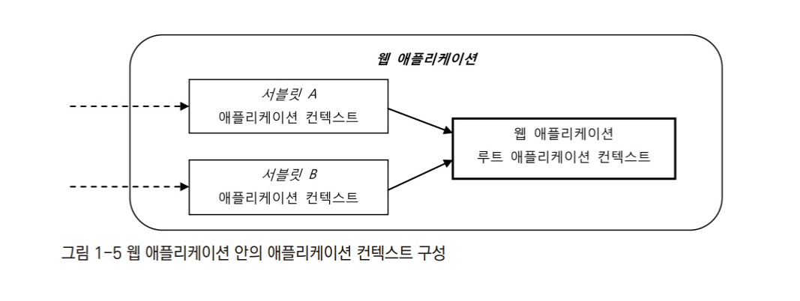
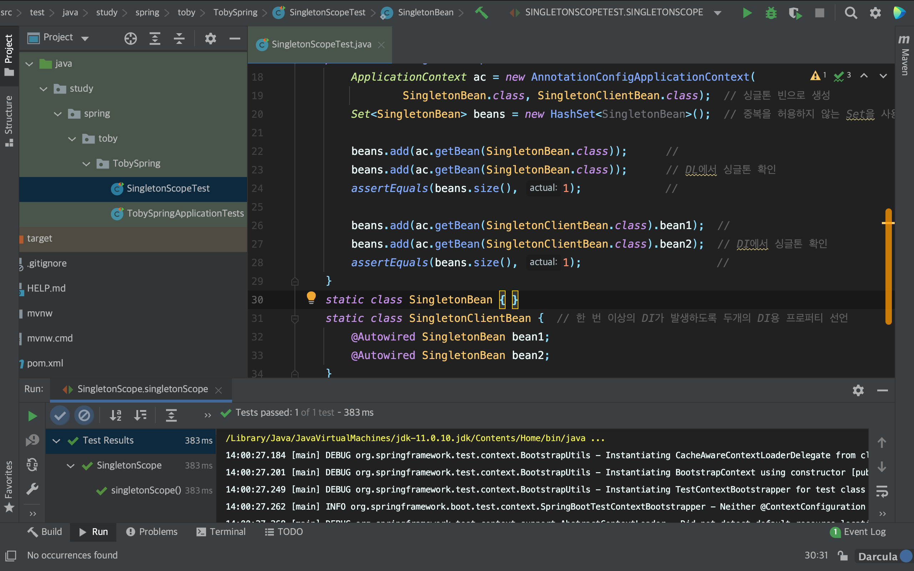
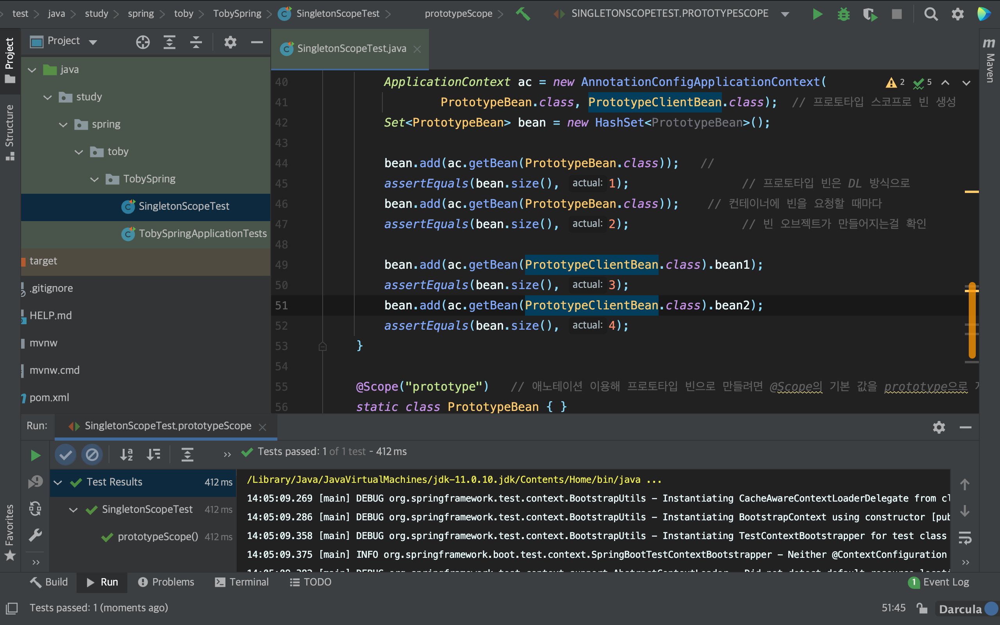

# ToC

- 1장 IoC 컨테이너와 DI
  - [1.1장 IoC 컨테이너 : 빈 팩토리와 애플리케이션 컨텍스트](#1-1)
  - [1.2장 IoC/DI를 위한 빈 설정 메타정보 작성](#1-2)
  - [1.3장 프로토타입과 스코프](#1-3)
  - [1.4장 기타 빈 설정 메타정보](#1-4)

---

# 1.1장 IoC 컨테이너 : 빈 팩토리와 애플리케이션 컨텍스트

스프링에서 제어권을 가지는 주체를 스프링 컨테이너라고 한다. 오브젝트의 생성과 관계 설정, 사용, 제거 등의 작업을 애플리케이션 코드가 아닌 이 스프링 컨테이너에서 담당한다. 그래서 이 컨테이너를 IoC 컨테이너라고 부른다.

스프링에선 IoC 컨테이너를 빈 팩토리 또는 애플리케이션 컨텍스트라고도 부른다.

오브젝트 사이의 런타임 관계를 설정하는 DI 관점으로 볼 때는 스프링 컨테이너를 빈 팩토리(`BeanFactory`)라고 부른다. 그러나 스프링 컨테이너는 단순한 DI를 넘어 다양한 역할을 수행하므로 DI를 위한 빈 팩토리에 엔터프라이즈 애플리케이션을 개발하는데 필요한 여러가지 컨테이너 기능을 추가한 것을 애플리케이션 컨텍스트(`ApplicationContext`)라고 부른다. 

애플리케이션 컨텍스트는 IoC와 DI를 위한 빈 팩토리이면서 더 많은 기능을 가졌다고 이해하면 된다.

실제로도 빈팩토리와 애플리케이션 컨텍스트는 스프링에서 인터페이스로 정의되어 있는데, 애플리케이션 컨텍스트는 빈팩토리 인터페이스를 상속하는 인터페이스이다.

~~~java
public interface ApplicationContext extends ListableBeanFactory, HierachicalBeanFactory, MessageSource, ApplicationEventPublisher, ResourcePatternResolver { }
~~~

이 `ApplicationContext`를 구현한 클래스의 오브젝트를 스프링 컨테이너 또는 IoC 컨테이너라고 부른다.

## IoC 컨테이너를 이용해 애플리케이션 만들기

**요구사항**

- POJO 클래스를 이용한다.
- 메세지를 생성하여 메세지를 받아서 출력하는 프로그램을 개발한다.

**Hello.class**

~~~java
public class Hello {
   String name;
   Printer printer;
  
   public String sayHello() {
      return "Hello "+name;
   }
  
   public void print() {
      this.printer.print(sayHello());
   }
  
   public void setName(String name) {
      this.name = name;
   }
  
   public void setPrinter(Printer printer) {
      this.printer = printer;
   }
}
~~~

**Printer.class**

~~~java
public interface Printer {
   void print(String message);
}
~~~

**StringBuffer.class (StringBuffer를 사용한 Printer 구현 클래스)** 

~~~java
public class StringPrinter implements Printer {
   private StringBuffer buffer = new StringBuffer();
  
   public void print(String message) {
      this.buffer.append(message);
   }
  
   public String toString() {
      return this.buffer.toString();
   }
}
~~~

**ConsolePrinter.class (Console 출력 방식의 Printer 구현 클래스)**

~~~java
public class ConsolePrinter implements Printer {
   public void print(String message) {
      System.out.println(message);
   }
}
~~~

**코드 설명**

`Hello` 클래스는 `Printer`라는 인터페이스를 의존한다. 런타임시에 실제로 어떤 오브젝트를 사용할지를 알지 못한다. 

`Printer` 인터페이스는 두가지 구현 객체가 존재한다. `StringBuffer`를 이용해서 출력하는 클래스와 `Console`에 출력하는 클래스이다.

**설정 메타정보**

스프링의 설정 메타정보는 XML 파일이 아니다. XML에 담긴 내용을 읽어서 설정 메타정보로 활용하는건 맞지만, 스프링이 갖고있는 설정 메타정보가 XML 파일은 아니다.

스프링의 메타 정보는 `BeanDefinition` 인터페이스로 표현되는 순수한 추상정보이다. 파일의 포맷과 상관없이 스프링의 설정 메타정보의 내용을 표현했다면 무엇이든 사용가능하다. 데이터의 포맷과 구조에 맞게 읽어와 `BeanDefinition` 오브젝트로 변환하는 `BeanDefinitionReader`가 있으면 되기 때문이다.

스프링 IoC 컨테이너는 이 `BeanDefinition` 으로 만들어진 메타 정보를 담은 오브젝트를 사용하여 IoC와 DI 작업을 수행한다.

`BeanDefinition`에서 정의되는 빈 메타정보는 다음과 같다.

- 빈 아이디, 이름 : 빈 오브젝트를 구분하는 식별자
- 클래스, 클래스 이름 : 빈으로 만들 POJO 클래스 정보
- 스코프 : 싱글톤, 프로토타입과 같은 빈의 생성 방식과 존재 범위
- 프로퍼티 값 또는 참조 : DI에 사용할 프로퍼티 이름과 값 또는 참조하는 빈의 이름
- 생성자 파라미터 값 또는 참조  : DI에 사용할 생성자 파라미터 이름과 값 또는 참조할 빈의 이름
- 지연된 로딩 여부, 우선 빈 여부, 부모 빈 정보, 빈팩토리 이름 등

스프링 애플리케이션은 POJO 클래스와 설정 메타정보를 이용하여 IoC 컨테이너가 만들어주는 오브젝트의 조합이라 할 수 있다.

**BeanDefinition을 이용한 빈 등록**

~~~java
BeanDefinition helloDef = new RootBeanDefinition(Hello.class);
helloDef.getPropertyValues().addPropertyValue("name", "Spring");
ac.registerBeanDefinition("hello2", helloDef);
~~~

**빈 등록 테스트**

~~~java
Hello hello = ac.getBean("hello", Hello.class);

assertThat(hello.sayHello(), is("Hello Spring"));
assertThat(ac.getBeanFactory().getBeanDefinitionCount(), is(1));
~~~

## IoC 컨테이너의 종류와 사용방법

### StaticApplicationContext

`StaticApplicationContext`는 코드를 통해 빈 메타정보를 등록하기 위해 사용한다. 실무에서는 사용되지 않으며, 권고되지도 않는다. 테스트로 검증할때만 사용해야 한다.

### GenericApplicationContext

일반적인 애플리케이션 컨텍스트의 구현 클래스이다. `StaticApplicationContext`가 내부의 코드를 통해 빈 메타정보를 등록한다면, `GenericApplicationContext`는 외부의 리소스(XML파일 등)를 읽어들여 메타정보로 전환한다.

XML로 만든 빈 설정 메타정보

~~~xml
<?xml version="1.0" encoding="UTF-8"?>
<beans xmlns="http://www.springframework.org/schema/beans"
       xmlns:xsi="https://www.w3.org/2001/XMLSchema-instance"
       xsi:schemaLocation="http://www.springframework.org/schema/beans
                           http://www.springframework.org/schema/spring-beans-3.0.xsd">
  
  <bean id="hello" class="springbook.learningtest.spring.ioc.bean.Hello">
  	<property name="name" value="Spring" />
    <property name="printer" value="printer" />
  </bean>
</beans>
~~~

GenericApplicationContext 테스트

~~~java
@Test
public void genericApplicationContext() {
   GenericApplicationContext ac = new GenericApplicationContext();
   XMLBeanDefinitionReader reader = new XMLBeanDefinitionReader(ac);
   reader.loadBeanDefinitions(
   		"springbook/learningtest/spring/ioc/genericApplicationContext.xml"
   );
   ac.refresh();
  
   Hello hello = ac.getBean("hello", Hello.class);
   hello.print();
  
   assertThat(ac.getBean("printer").toString(), is("Hello Spring"));
}
~~~

애플리케이션 개발하면서 `GenericApplicationContext`를 직접 사용할 일은 없다. 독립형 애플리케이션을 개발할 필요가 없기 때문이다. 그러나 독립형 애플리케이션이 필요한 일이 있다. 테스트 환경에서이다. 

JUnit 테스트는 테스트내에서 사용되도록 애플리케이션 컨텍스트를 자동으로 만들어주는데 이 때 만들어주는 애플리케이션 컨텍스트가  `GenericApplicationContext` 이다.

### GenericXmlApplicationContext

`GenericXmlApplicationContext`는 `XmlBeanDefinitionReader`를 내장하고 있다. 이 때문에 XML 파일을 읽어들이고, `refresh()`를 통해 초기화하는 것까지 한 줄로 할 수 있다.

XML 파일정보는 리소스 로더가 읽을 수 있는 형식으로 `GenericXmlApplicationContext` 생성자에 넣어주면 된다.

### WebApplicationContext

스프링 애플리케이션에서 가장 많이 사용되는 애플리케이션 컨텍스트이다. `WebApplicationContext`는 `ApplicationContext`를 확장한 인터페이스이다.

스프링 컨테이너가 DI 작업을 수행해준다고 하지만, 그것만으로 애플리케이션을 작동시킬 수는 없다. `main()`와 같이 빈 오브젝트의 메소드를 호출함으로써 애플리케이션을 동작시켜야 한다.

하나의 빈 오브젝트만 호출하면, 각각의 오브젝트들끼리 DI로 연결되어 있으므로 애플리케이션이 작동될 것이다. 이 때 빈 오브젝트를 호출하는 메소드가 `getBean()`이 사용된다.

그러나 문제는 웹 애플리케이션에서는 `main()`을 호출할 방법이 없다. 그래서 웹에서는 `main()` 대신 서블릿 컨테이너가 브라우저로부터 오는 HTTP 요청을 받아서 해당 요청에 매핑되어 있는 서블릿을 실행해주는 방식으로 웹 애플리케이션을 동작시킨다.

정리하면, `main()` 역할을 하는 서블릿을 만들어두고, 미리 애플리케이션 컨텍스트를 생성해둔 다음, 요청이 서블릿으로 들어올 때마다 `getBean()`으로 필요한 빈을 가져와 정해진 메소드를 실행해주면 된다.

서블릿 컨테이너는 클라이언트로부터 들어오는 요청을 받아서 서블릿을 동작시키는 역할을 한다. 서블릿은 웹 애플리케이션이 시작될때 미리 만들어둔 `WebApplicationContext`에게 빈 오브젝트로 구성된 애플리케이션의 기동 역할을 해줄 빈을 요청해서 받아둔다. 

### 웹 애플리케이션의 IoC 컨테이너 구성 방법

- 스프링 애플리케이션 요청을 처리하는 서블릿안에서 생성
- 웹 애플리케이션 레벨에서 생성

이에 따라 스프링 웹 애플리케이션은 2개의 WebApplicationContext 오브젝트가 생성된다.

두 컨텍스트가 공유해서 사용하는 빈을 담아놓는 별도의 컨텍스트를 만드는데, 이 컨텍스트가 계층구조에서 최상위에 해당하는 루트 애플리케이션 컨텍스트가 된다.

**두 개 이상의 서블릿을 구분해서 애플리케이션 컨텍스트를 계층구조로 만드는 이유**

- 전체 애플리케이션에서 웹 기술에 의존적인 부분과 그렇지 않은 부분을 구분하기 위함

## IoC 컨테이너 계층구조

모든 애플리케이션 컨텍스트는 부모 애플리케이션 컨텍스트를 가질 수 있으며, 이를 이용하여 트리구조의 컨텍스트 계층을 만들 수 있다.

계층구조 안의 모든 컨텍스트는 독립적인 설정정보를 이용하여 빈 오브젝트를 만들고 각자 독립적으로 관리하는 빈이 존재한다.

DI를 위해 애플리케이션 컨텍스트가 빈을 찾을 때는 자신이 관리하는 빈에서 찾아보고 없으면 부모 컨텍스트에서 빈을 찾는다. 이 때 형제 관계의 애플리케이션 컨텍스트 또는 자식 관계의 애플리케이션 컨텍스트에서는 찾지 않는다.
위의 이미지에서 A1 에서 빈을 찾는다면, 루트 애플리케이션 컨텍스트에서까지만 찾을뿐 자식관계인 B1, 형제관계인 A2에서는 찾지않는다.   

검색 순서는 자기 자신 컨텍스트, 부모 컨텍스트 순으로 이어진다.

계층구조의 컨텍스트를 만드는 코드는 아래와 같다.

~~~java
// 부모 애플리케이션 컨텍스트 생성
String basePath = StringUtils.classPath(ClassUtils.classPackageAsResourcePAth(getClass()));
ApplicationContext parent = new GenericXmlApplicationContext(basePath + "parentContext.xml");

// 자식 애플리케이션 컨텍스트 생성
GenericApplicationContext child = new GenericApplicationContext(parent);
~~~

자식 컨텍스트를 생성할때 바라보는 노드로 부모 컨텍스트를 지정한다는 점이 중요하다.

부모 컨텍스트에서의 빈 조회를 제한 할 수도 있고, 반대로 자식 컨텍스트를 건너뛰고 직접 부모 컨텍스트로부터 빈을 조회할 수도 있다.

### 웹 애플리케이션 컨텍스트 구성 방법

- 서블릿 컨텍스트와 루트 애플리케이션 컨텍스트 계층구조
  - 가장 많이 사용되는 구성 방법
  - 웹 관련 빈은 서블릿 컨테이너에 두고,
    나머지는 루트 애플리케이션 컨텍스트에 등록
- 루트 애플리케이션 컨텍스트 단일구조
  - Spring WebMVC를 사용하지 않는 구성방법
  - 서블릿 애플리케이션 컨텍스트도 필요없음
- 서블릿 컨텍스트 단일구조
  - 스프링 외의 프레임워크를 사용하지 않거나 서비스 엔진에서 스프링의 빈을 이용할 생각이 아닐 때 사용하는 구성 방법
  - 서블릿 컨텍스트가 부모 컨텍스트를 갖지 않으므로 루트 컨텍스트가 된다.
  - 하지만 모든 컨텍스트에서 공유되는 루트 컨텍스트와는 구별된다. (계층 구조의 차이)

### 루트 애플리케이션 컨텍스트 등록

- ContextLoaderListener 등록
- ContextConfigLocation
- contextClass

### 서블릿 애플리케이션 컨텍스트 등록

- `<servlet-name>`
- `<load-on-startup>`

 

# IoC/DI를 위한 빈 설정 메타정보 작성

IoC 컨테이너가 하는 역할은 애플리케이션을 구성하는 오브젝트를 생성하고 관리하는 것. POJO 클래스와 서비스 오브젝트가 그 대상이며 이렇게 IoC 컨테이너에 의해 관리되는 오브젝트를 빈이라고 한다.

IoC 컨테이너가 빈을 관리하기 위해서는 빈의 메타정보가 필요하다. 이 메타정보를 통해 빈의 클래스와 이름을 제공받는다.

외부 파일이나 애노테이션으로부터 전용 리더를 통해 읽어들여서 BeanDefinition 타입의 오브젝트로 변환한다. 이 BeanDefinition 정보를 IoC 컨테이너가 활용한다.

BeanDefinition은 순수한 오브젝트로 표현되는 빈 생성 정보다. BeanDefinition 생성기를 사용할 수만 있다면 빈 설정 메타정보를 담은 소스는 어떻게 만들어도 상관없다.

## 빈 설정 메타정보

BeanDefinition에는 IoC 컨테이너가 빈을 만들때 필요한 핵심 정보가 담기며, 여러 개의 빈을 만드는데 재사용될 수 있다.

BeanDefinition에는 빈의 이름이나 아이디를 나타내는 정보는 포함되지 않는다. 이 때문에 메타정보는 같지만 이름은 다른 여러개의 빈 오브젝트로 재사용이 가능하다.

## 빈 등록 방법

일반적으로 XML 문서, 애노테이션 등의 외부 리소스로 빈 메타정보를 작성하고 이를 리더를 통해 ApplicationContext가 사용할 수 있는 정보로 변환하는 방법을 사용한다.

빈을 등록하는 5가지 방법이다.

### XML : \<bean> 태그

가장 단순하면서 가장 강력한 빈 설정방법.

`<bean>`을 이용하면 스프링 빈 메타정보의 거의 모든 항목을 지정하는 것이 가능하다.

id와 class 두 개의 애트리뷰트를 사용한다. id는 생략이 가능하다.

~~~xml
<bean id="hello" class="springbook.learningtest.spring.ioc.bean.Hello">
	...
</bean>
~~~

bean은 다른 빈의 \<property> 태그안에 정의될수도 있다. 이때는 id를 지정하지 않는다. 이렇게 다른 빈의 설정 안에서 정의되는 빈을 내부 빈(Inner Bean)이라 한다.

~~~xml
<bean id="hello" class="springbook.learningtest.spring.ioc.bean.Hello">
   <property>
      <bean class="springbook.learningtest.spring.ioc.bean.StringPrinter" />
   </property>
</bean>
~~~

### XML : 네임스페이스와 전용 태그

스프링은 기술적인 설정과 기반 서비스를 빈으로 등록할때를 위해 의미가 잘 드러나는 네임스페이스와 태그를 가진 설정 방법을 제공한다.

그냥 \<bean> 태그를 사용한 예이다.

~~~xml
<bean id="mypointcut"
      class="org.springframework.aop.aspectj.AspectJExpressionPointcut">
   <property name="expression" value="execution(* *..*ServiceImpl.upgrade*(..))" />
</bean>
~~~

위의 \<bean>태그로 작성된 포인트컷을 \<aop:pointcut> 태그로 바꿀수 있다.

~~~xml
<aop:pointcut id="mypointcut"
              expression="execution(* *..*SErviceImpl.upgrade*(..))" />
~~~

\<bean>태그로 선언한것과 동일하게 빈 설정 메타정보로 변환하였다. 그러나 네임스페이스(`aop`), 전용 애트리뷰트(`pointcut`)를 이용해 선언했기 때문에 내용이 직관적으로 드러난다.

또 여러개의 \<bean> 태그를 네임스페이스를 이용해서 한줄로 처리할 수도 있다.

~~~xml
<bean id="userController" class="com.mycompany.user.UserController">
	<property name="service" ref="userService" />
</bean>
<bean id="userService" class="com.mycompany.user.UserService">
	<property name="dao" ref="userDao" />
</bean>
<bean id="userDao" class="com.mycompany.user.UserDao">
</bean>
~~~

 위의 \<bean> 태그를 한 줄로 대체하는 예이다.

~~~xml
<aop:module id-prefix="user" class-prefix="User" package="com.mycompany.user" />
~~~

### 자동인식을 이용한 빈 등록 : 스테레오 타입 애노테이션과 빈 스캐너

빈 스캐닝을 통해 특정 애노테이션이 붙은 클래스를 자동으로 찾아서 빈으로 등록해주기도 한다. 이 때 스캐닝 작업을 담당하는 오브젝트를 빈 스캐너라고 한다.

예제 코드이다.

~~~java
@Component
public class AnnotatedHello {
   ...
}
~~~

애노테이션 `@Component`가 붙어있어서 빈 스캐너가 이를 감지하여 자동으로 빈으로 등록해준다. 이 때 클래스이름이 빈의 id가 되며, 위의 예제코드에서는 `annotetedHello`로 등록된다.

만약 빈의 이름을 지정하고 싶다면 애노테이션의 파라미터로 넣어주면 된다.

~~~java
@Component("myAnnotatedHello")
public class AnnotatedHello {
   ...
}
~~~

정말 빈이 등록되었는지 확인하는 테스트 코드이다.

~~~java
@Test
public void simpleBeanScanning() {
   ApplicationContext ctx = new AnnotationConfigApplicationContext(
      "springbook.learningtest.spring.ioc.bean");
  
   AnnotetedHello hello = ctx.getBean("annotatedHello", AnnotatedHello.class);
  
   assertTrue(hello, is(notNullValue()));
}
~~~

### 자바 코드에 의한 빈 등록 : @Configuration 클래스의 @Bean 메소드

스프링은 코드를 이용해서 오브젝트를 생성하고 DI 진행하는 방식으로 만들어진 오브젝트를 빈으로 쓸 수 있는 방법을 제공한다. 

~~~java
@Configuration
public class AnnotatedHelloConfig {
   @Bean
   public AnnotatedHello annotatedHello() {
      return new AnnotatedHello();
   }
}
~~~

XML 문서의 \<beans>를 `@Configuration` 클래스로, \<bean>을 `@Bean` 메소드로 대응한다.

위의 코드를 통해서 메소드뿐 아니라 `@Configuration` 애노테이션이 붙은 클래스 자신도 빈으로 등록이 된다. 이는 `@Component`를 통한 빈 등록과 같다.

**자바 코드에 의한 설정의 장점**

- 컴파일러/IDE를 통한 타입 검증이 가능
- 자동완성 같은 IDE 지원을 이용할 수 있다.
- 이해하기 쉽다.
- 복잡한 빈 설정을 손쉽게 가능

### 자바 코드에 의한 빈 등록 : 일반 빈 클래스의 @Bean 메소드

클래스에 `@Configuration`을 붙이지 않아도 메소드에 `@Bean`을 붙여서 메소드를 빈으로 등록해서 사용할 수 있다.

`@Configuration`이 붙은 클래스에서 `@Bean`이 붙은 메소드는 싱글톤이기 때문에 여러번 호출돼도 하나의 오브젝트만 리턴되는 것이 보장된다. 하지만 일반 클래스에 `@Bean` 을 사용한 경우는 DI 설정을 위해 Bean 메소드를 호출할때마다 매번 다른 오브젝트를 받게 된다.

~~~java
public class HelloService {
   @Bean
   public Hello hello() {
      Hello hello = new Hello();
      hello.setPrinter(printer());
      return hello;
   }
}
~~~

따라서 일반 빈 클래스에서 `@Bean` 애노테이션을 사용하면서 DI를 위해 다른 메소드를 호출할때는 해당 메소드를 생성자로 주입받아서 싱글톤 오브젝트로 생성해두고 이를 가져다 사용하는 방식으로 해결해야한다.

~~~java
public class HelloService {
   private Printer printer;
  
   public void setPrinter(Printer printer) {
      this.printer = printer;
   }
  
   @Bean
   public Hello hello() {
      Hello hello = new Hello();
      hello.setPrinter(this.printer);
      return hello;
   }
}
~~~

 

## 빈 등록 메타정보 구성 전략

- **XML 단독 사용**
  - 모든 설정 정보를 자바 코드에서 분리하고 순수한 POJO 코드를 유지할 수 있는 방법
- **XML과 빈 스캐닝의 혼용**
- **XML 없이 빈 스캐닝 단독 사용**
  - 모든 빈의 정보가 자바 코드에 담겨있으므로 타입 검증의 이점이있다.

 

# 1.3 프로토타입과 스코프

스프링의 빈은 싱글톤으로 생성된다. 요청이 있을 때마다 애플리케이션 로직을 담은 오브젝트를 새로 담는건 비효율적이기 때문이다.

그러나 하나의 빈 설정으로 여러 오브젝트를 만들어서 사용할때는 싱글톤이 아닌 다른 방법으로 빈을 만들어 사용해야한다.

싱글톤 빈이 아닌 빈은 크게 <mark>프로토타입 빈</mark>과 <mark>스코프 빈</mark>으로 구성된다.

> 빈 스코프란, 빈 오브젝트가 만들어져 존재할 수 있는 범위를 의미한다. 빈 오브젝트의 생명주기는 스프링 컨테이너가 관리하므로 스코프의 끝까지 빈 오브젝트가 존재하게 된다.

> 싱글톤 스코프는 컨테이너의 스코프와 싱글톤의 스코프가 일치하기 때문에 컨테이너 스코프라고도 한다.

## 1.3.1 프로토타입 스코프

싱글톤 빈은 DI이든 DL(Dependency Lookup, 의존객체 조회)이든 상관없이 매번 같은 오브젝트가 사용된다는 사실을 테스트를 통해 확인하자.

~~~java
@Test
public void singletonScope() {
   ApplicationContext ac = new AnnotationConfigApplicationContext(
      SingletonBean.class, SingletonClientBean.class);  // 싱글톤 빈으로 생성
   Set<SingletonBean> beans = new HashSet<SingletonBean>();  // 중복을 허용하지 않는 Set을 사용
  
   beans.add(ac.getBean(SingletonBean.class));      //
   beans.add(ac.getBean(SingletonBean.class));      // DL에서 싱글톤 확인
   assertEquals(beans.size(), 1);                   //
  
   beans.add(ac.getBean(SingletonClientBean.class).bean1);  //
   beans.add(ac.getBean(SingletonClientBean.class).bean2);  // DI에서 싱글톤 확인
   assertEquals(beans.size(), 1);                           //
}
static class SingletonBean { }
static class SingletonClientBean {  // 한 번 이상의 DI가 발생하도록 두개의 DI용 프로퍼티 선언
   @Autowired SingletonBean bean1;
   @Autowired SingletonBean bean2;
}
~~~

테스트를 실행해보면 DI에서든 DL에서든 Set에 빈을 추가했음에도 Set의 `size()`가 1에 머무러있는걸 알 수 있다. 

항상 동일한 오브젝트가 돌아왔기 때문이며, 빈 오브젝트가 싱글톤이기 때문이다.

프로토타입 스코프로 빈을 선언해서 다시 테스트한다.

~~~java
@Test
public void prototypeScope() {
   ApplicationContext ac = new AnnotationConfigApplicationContext(
      PrototypeBean.class, PrototypeClientBean.class);  // 프로토타입 스코프로 빈 생성
   Set<PrototypeBean> bean = new HashSet<PrototypeBean>();
  
   beans.add(ac.getBean(PrototypeBean.class));   //    
   assertEquals(beans.size(), 1);                // 프로토타입 빈은 DL 방식으로 
   bean.add(ac.getBean(PrototypeBean.class));    // 컨테이너에 빈을 요청할 때마다
   assertEquals(beans.size(), 2);                // 빈 오브젝트가 만들어지는걸 확인 
  
   bean.add(ac.getBean(PrototypeClientBean.class).bean1);
   assertEquals(beans.size(), 3);
   bean.add(ac.getBean(PrototypeClientBean.class).bean2);
   assertEquals(beans.size(), 4);
}

@Scope("prototype")   // 애노테이션 이용해 프로토타입 빈으로 만들려면 @Scope의 기본 값을 prototype으로 지정
static class PrototypeBean { }
static class PrototypeClientBean {
   @Autowired PrototypeBean bean1;
   @Autowired PrototypeBean bean2;
}
~~~

프로토타입 빈으로 생성하니 매번 새로운 오브젝트가 만들어져서 빈을 Set에 추가할 때마다 Set의 `size()`가 1씩 늘어난걸 알 수 있다.

#### 프로토타입 빈 생명주기와 종속성

스프링이 관리하는 빈은 모든 생명주기를 스프링 컨테이너에서 관리한다. 그러나 프로토타입 빈은 다르다.

프로토타입 스코프를 갖는 빈은 요청이 있을때마다 컨테이너가 생성하고  초기화하고 DI까지 해주지만, 빈을 제공한 이후부터는 컨테이너가 더 이상은 빈을 관리하지 않는다.

프로토타입 빈은 컨테이너가 초기 생성 시에만 관여하고, DI 한 후에는 더이상 신경쓰지 않기 때문에, DI 이후부터는 DI받은 오브젝트에게 프로토타입 빈의 관리가 넘겨진다. 따라서 프로토타입 빈의 생명주기는 DI 받은 오브젝트의 생명주기를 따른다.

#### 프로토타입 빈의 용도

- `new`로 오브젝트를 생성하는 것을 대신하기 위해 사용
-  매번 새로운 오브젝트가 필요하며 DI를 통해 다른 빈을 사용할 수 있는 상황에 프로토타입 빈이 좋은 선택이 된다.

#### 프로토타입 빈의 DL 전략

- ApplicationContext, BeanFactory
  - ApplicationContext 또는  BeanFactory를 DI 받은 뒤에  `getBean()`을 호출해서 빈을 가져오는 방법이다.
- ObjectFactory, ObjectFactoryCreatingFactoryBean
  - 직접 ApplicationContext를 사용하지 않으려면 중간에 `getBean()`을 호출할 오브젝트가 필요 -> 팩토리 필요
  - 팩토리를 DI 받아서 필요할때 `getObject()`같은 메서드 호출
  - 스프링이 제공하는 `ObjectFactory` 인터페이스 사용
  - `ObjectFactory`는 DL을 이용해 빈을 가져와야하는 모든 경우에 적용 가능
- ServiceLocatorFactoryBean
  - 스프링이 제공하는 인터페이스 대신 직접 정의한 팩토리 인터페이스를 `ObjectFactory`처럼 이용가능.
- 메서드 주입
  - 메소드를 통해 DI받는게 아니라 메소드 코드 자체를 주입하는 것
  - ApplicationContext와 getBean() 메소드를 사용해 새로운 프로토타입 빈을 가져오는 기능을 담당하는 메소드를 런타임시에 추가하는 기술.
- Provider\<T>
  - `@Inject`와 함께 JSR-330에 추가된 표준 인터페이스이다.
  - ObjectFactory와 유사하지만 `ObjectFactoryCreatingFactoryBean`을 이용해 빈을 등록해주지 않아도 되기때문에 더 편하다는 이점이 있다.

 

## 1.3.2 스코프

#### 스코프의 종류

스프링이 제공하는 스코프는 아래 4가지를 제공한다.

- 요청 (request)
- 세션 (session)
- 글로벌세션 (global session)
- 애플리케이션 (application)

#### 요청 스코프

- 하나의 웹 요청안에서 생성되고 요청이 끝나면 제거된다.

- 각 요청별로 독립적인 빈이 생성되기 떄문에 빈 오브젝트에 상태값을 저장해도 된다.

- 하나의 웹 요청을 처리하는 동안 참조하는 요청 스코프빈은 항상 동일한 오브젝트임이 보장되지만, 동시에 웹 요청이 달라지면 별도의 요청 스코프 빈이 생성되기 때문에 동시에 여러 요청을 보내도 안전하다.

#### 세션 스코프 / 글로벌세션

- HTTP 세션과 같은 존재 범위를 갖는 빈으로 만들어주는 스코프다.

- 세션 스코프를 이용 하면 HTTP 세션에 저장되는 정보를 모든 계층에서 안전하게 이용이 가능하다.

- 글로벌세션 스코프는 포틀릿에만 존재하는 글로벌 세션에 저장되는 빈이다.

#### 애플리케이션 스코프

- 서블릿 컨텍스트에 저장되는 빈 오브젝트이다.
- 컨텍스트가 존재하는 동안 유지되는 싱글톤 스코프와 비슷한 스코프를 갖는다.
- 싱글톤 스코프와 마찬가지로 상태를 갖지 않거나 상태가 있더라도 읽기전용으로 만들거나, 멀티쓰레드 환경에서 안전하도록 만들어야 한다.

#### 스코프 빈의 사용 방법

- 하나 이상의 오브젝트가 만들어져야 하기 때문에 싱글톤에 DI 해주는 방법으론 사용불가능하다.
- <mark>스코프 빈은 프로토타입 빈과 마찬가지로 DL 방식으로 사용해야 하나 DI를 사용하기 위해 스코프 빈에 대한 프록시를 생성해서 DI 한다.</mark>
- 클라이언트에서 스코프 프록시 오브젝트를 실제 스코프 빈처럼 사용하면 <mark>프록시에서 현재 스코프에 맞는 빈 오브젝트로 작업을 위임한다.</mark>
- 스코프 프록시는 각 요청에 연결된 세션 정보를 참고해서 사용자마다 다른 오브젝트를 사용하게 해준다.
- 스코프 프록시는 실제 스코프 오브젝트를 상속한다.
- 프록시 방식의  DI를 적용하면 스코프 빈이지만 싱글톤 빈을 사용하듯 편하게 쓸수 있다는 장점이 있다. 그러나 주입되는 빈의 스코프를 모르면 코드를 이해하는 것이 어려울수도 있다.

#### 커스텀 스코프와 상태를 저장하는 빈 사용하기

- 스프링이 기본으로 제공하는 스코프외에 임의의 스코프를 만들어 사용할 수 있다.
- 싱글톤외에 스코프를 사용한다는건 기본적으로 빈에 상태를 저장해두고 사용한다는 의미이다.
- 스프링에서 Scope 인터페이스를 구현해서 새로운 스코프를 작성할 수 있다.
- 빈에 상태를 저장해두는 방식을 선호하지 않는다면, 상태정보를  URL, 파라미터, 쿠키, 폼 히든 필드, DB, HTTP 세션등에 분산해 저장해두고 코드로 관리하면 된다.

 

# 1.4 기타 빈 설정 메타정보

## 1.4.1 빈 이름

빈은 하나이상의 식별자를 가질 수 있으며, 빈의 식별자는 빈이 정의된 애플리케이션 컨텍스트 내에서 고유하다.

빈의 식별자는 XML이라면,  `<bean>` 태그의 `id`, `name` 애트리뷰트를 이용해 정의 가능하다.

#### id

XML의 ID 타입의 기준을 지켜야 한다.

-  공백이 들어갈 수 없다.
- 첫글자는 알파벳과 밑줄(_), 그리고 허용된 일부 언어문자만 사용가능하다.
- 나머지 글자는 알파벳과 밑줄(_), 숫자와 점(.)을 이용한다. 그외 특수문자는 사용 불가능하다.

위의 기준을 지켜서 정의한 빈 id의 예이다.

~~~xml
<bean id="_hello.Service123" class="..." />
~~~

id에 사용하는 값은 빈을 대표하는 타입 이름을 첫글자만 소문자로 바꿔서 사용한다.

`UserService` 타입의 빈이라면, 다음과 같이 id를 만든다.

~~~xml
<bean id="userService" class="..." />
~~~

#### name

id와 달리 name은 제약이 없다. 또한 여러개의 하나의 빈에 여러개 name을 등록할 수 있다. 여러개의 name을 등록할 때는 `,또는 `;`으로 구분한다.

~~~xml
<bean name="123,/hello;헬로우" class="..." />
~~~

위의 빈은 `123`, `/hello`, `헬로우`로 이름이 등록된 빈이다.

name을 복수로 등록 가능한 이유는 이전에 만들었던 빈과 그 설정을 그대로 가져와서 사용하는 일이 발생하기 때문이다. 새로 구성한 빈들과 이름을 그 때마다 새로 짓기대신 기존에 존재하는 빈에 이름을 추가하는 방식이 편리하기 때문이다.

#### 애노테이션에서 빈 이름

빈 스캐너가 자동으로 인식하도록 한 경우에는 보통 클래스 이름을 빈 이름으로 그대로 사용한다. 첫 글자만 소문자로 바꿔서 사용한다.

~~~java
@Component
public class UserService { ... }
~~~

이렇게 할경우 빈 이름은 `userService`가 된다.

메서드도 마찬가지다.

~~~java
@Configuration
public class Config {
   @Bean
   public UserDao userDao() { ... }
}
~~~

빈 이름은 `userDao`가 된다.

자동으로 빈 이름을 사용하는 것이 더 선호되나 임의로 빈 이름을 등록하는 방법도 있다.

~~~java
@Component("myUserService")
public class UserService { ... }
~~~

또는

~~~java
@Component
@Named("myUserService")
public class UserService { ... }
~~~

메서드를 빈으로 등록할 때 임의의 빈 이름을 지정하는 방식은 아래와 같다.

~~~java
@Configuration
public class Config {
   @Bean(name="myUserDao")
   public UserDao userDao() { ... }
}
~~~

`@Bean`을 이용할 경우에는 빈 이름을 여러개 지정할 수 있다.

~~~java
@Configuration
public class Config {
   @Bean(name={"myUserDao", "userDao"})
   public UserDao userDao() { ... }
}
~~~

 

## 1.4.2. 빈 생명주기 메소드

### 초기화 메서드 ( Initialization Method )

빈 오브젝트가 생성되고  DI 작업까지 마친 다음에 실행되는 메서드이다.

초기화 메서드를 지정하는 방법은 4가지이다.

- 초기화 콜백 인터페이스
- init-method 지정
- @PostConstruct
- @Bean(init-method)

#### 초기화 콜백 인터페이스

InitializingBean 인터페이스를 구현해서 빈을 작성하는 방법이다.

`afterPropertiesSet()`는 프로퍼티 설정까지 마친 뒤에 호출되는데, 이 때 스프링 인터페이스를 노출하기 때문에 권장하는 방식이 아니다. 

#### init-method 지정

XML을 이용해 빈을 등록한다면 `<bean>` 태그에 init-method 애트리뷰트를 넣어서 초기화 작업을 수행할 메서드 이름을 지정할 수 있다.

~~~xml
<bean id="myBean" class="MyBean" init-method="initResource" />
~~~

DI 를 마친 뒤에 `initResource()`가 실행되도록 선언한 빈이다.

초기화 콜백 인터페이스와 달리 빈 클래스에 스프링 API가 노출되지 않는다는 장점이 있다.

그러나 XML 설정에서 init-method를 빼먹을 위험도 존재한다.

#### @PostConstruct

초기화를 담당할 메소드에 `@PostConstruct` 애노테이션을 부여해주기만 하면 되는 방식이다.

표준인터페이스이기도 하고, XML의 init-method 설정보다 직관적이기 때문에 가장 권장되는 방식이다. 

#### @Bean(init-method)

`@Bean` 메서드를 이용해서 빈을 정의하는 경우에는 `@Bean` 애노테이션의 nit-method 엘리먼트를 사용해서 초기화 메서드를 지정할 수 있다.

~~~java
@Bean(init-mehtod="initResource")
public void MyBean myBean() { ... }
~~~

### 제거 메서드

제거 메서드는 컨테이너가 종료될떄 호출해서 빈이 사용한 리소스를 반환하거나 종료 전에 처리해야 할 작업을 수행한다.

- 제거 콜백 인터페이스
  - `DisposableBean` 인터페이스를 구현해서 `destroy()`를 구현한다.
  - 스프링 API에 종속되는 코드를 만드는 단점이 있다.
- destroy-method
  - `<bean>` 태그에destory-method를 넣어 제거 메서드를 지정 가능ㅎ하다.
- @PreDestory
  - 컨테이너가 종료될때 실행될 메서드에 `@PreDestroy` 를 붙여주면 된다.
- @Bean(destroyMethod)
  - `@Bean` 애노테이션션의 destroyMethod 엘리먼트를 이용해서 제거 메서드를 지정할 수 있다.

 

## 1.4.3 팩토리 빈과 팩토리 메소드

- FactoryBean 인터페이스

  - FactoryBean 인터페이스를 구현해서 다이내믹 프록시를 생성하는 getObject() 메서드를 구현하고 팩토리 빈으로 등록해서 사용한다.

- 스태틱 팩토리 메서드

  - 클래스의 스태틱 메서드를 호출해서 인스턴스를 생성하는 방식이다.
  - factory-method 애트리뷰트를 이용하면 빈 오브젝트를 만들 수 있다.

- 인스턴스 팩토리 메서드

  - 오브젝트의 인스턴스 메서드를 이용해 빈 오브젝트를 생성할 수 있다.
  - 하지만 `FactoryBean`이라는 스프링 인터페이스에 종속적이라는 단점이 존재한다.
  - 임의의 오브젝트의 메서드를 호출해서 빈을 생성해야 한다면 factory-bean과 factory-method를 함께 사용할 수 있다.

  ~~~xml
  <bean id="logFactory" class="...LogFactory" />
  <bean id="log" factory-bean="logFactory" factory-method="craeteLog" />
  ~~~

- @Bean 메서드

  - 자바 코드로 등록하는 `@Bean` 메서드를 사용하는 방식도 팩토리 메서드 방식이다.
  - 스프링 컨테이너가 `@Bean` 메서드를 실행해 빈 오브젝트를 가져오는 방식이기 때문이다.
  - 특정 빈만 팩토리 메서드를 통해 만들고 싶다면 빈 클래스에 `@Bean`를 추가하는 방법을 사용하는 것이 좋다. 

 
