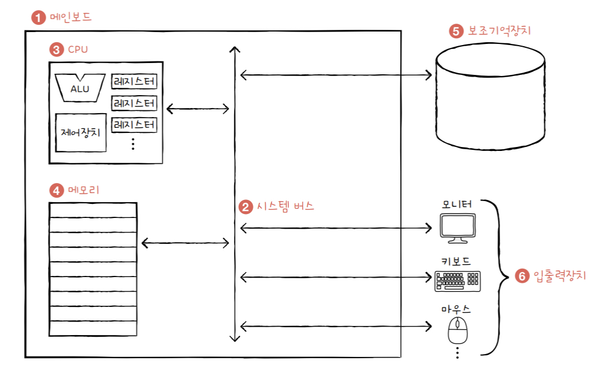

# 컴퓨터 구조 시작하기

컴퓨터 구조 -> 컴퓨터가 이해하는 정보   -> 데이터
                                        -> 명령어

            -> 컴퓨터 네 가지 핵심 부품 -> CPU
                                        -> 메모리
                                        -> 보조기억장치
                                        -> 입출력장치
                                          

- 컴퓨터의 핵심 부품중 CPU와 메모리(RAM)은 메인보드에 존재
- 보조기억장치(HDD/SSD), 입출력장치(마우스, 키보드)은 메인보드내 시스템버스 통해서 CPU/메모리와 연결
- CPU
  - ALU(Arithmetic Logic Unit)
    - 산술논리연산장치, CPU 내 계산기 역할. 연산 역할을 수행.
  - 레지스터
    - CPU 내부 임시 저장 장치. 프로그램 실행에 필요한 값들을 메모리에서 가져와서 저장. 
  - 제어 장치
    - 제어 신호라는 전기 신호를 내보내고 명령어를 해석하는 장치.
      - 제어 신호 (Control Signal) : 컴퓨터 부품들을 관리하고 작동시키기 위한 일종의 전기 신호. 
    - 레지스터에 있는 명령어를 해석하고 어떤 데이터가 필요한지 판단.
    - CPU가 메모리에 저장된 값을 읽고 싶을때 메모리(RAM) 향해 `메모리 읽기`라는 제어 신호를 보낸다.
    - CPU가 메모리에 어떤 값을 저장하고 싶을 땐 메모리(RAM) 향해 `메모리 쓰기`라는 제어 신호를 보낸다.
- 메모리
- 보조기억장치
- 입출력장치
