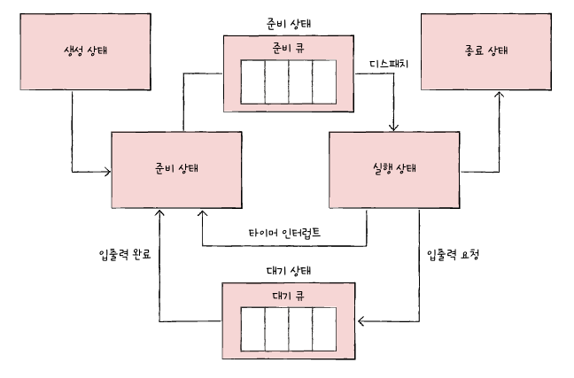

# CPU 스케줄링

멀티 프로세스 환경에서 프로세스가 효율적으로 동작하기 위해서 공정하게 CPU 자원을 배분하는 것

 

### 우선순위

우선순위는 CPU를 더 효율적으로 사용하기 위한 정보로 각 프로세스의 PCB에 저장된다. 프로세스 실행 순서를 결정하며, 우선순위가 높은 프로세스가 낮은 프로세스보다 먼저 실행된다.

**CPU 버스트(CPU burst)**

→ CPU를 이용하는 작업

**입출력 버스트(I/O burst)**

→ 입출력장치를 기다리는 작업

**입출력 집중 프로세스**

→ 입출력 버스트가 더 많은 프로세스

**CPU 집중 프로세스**

→ CPU 버스트가 더 많은 프로세스

CPU를 더 적게 사용하고 입출력 대기 시간이 긴 입출력 집중 프로세스가 더 우선순위가 높음

 

### 스케줄링 큐

매번 프로세스의 PCB에 있는 우선순위 정보를 확인하는건 비효율적이다. 그래서 운영체제는 프로세스들을 우선순위 큐에 담아서 관리한다.

대표적인 큐의 종류로 준비 큐와 대기 큐가 있다.

**준비 큐**

→ CPU를 이용하고 싶은 프로세스를 담은 큐

**대기 큐**

→ 입출력장치를 이용하기 위해서 대기 중인 프로세스를 담은 큐

 

### 선점형과 비선점형 스케줄링

프로세스가 CPU를 사용하고 있는데 급작스럽게 더 급한 프로세스가 생기면 CPU가 필요하다면 어떻게 될까?

선택지는 2가지다.

1. 선점형 스케줄링

   → 현재 CPU를 사용 중인 프로세스로부터 CPU 자원을 뺏는다.

   - 장점: 한 프로세스의 CPU 자원 독점을 막아 골고루 배분할 수 있다.
   - 단점: 그만큼 문맥 교환 과정에서 오버헤드가 발생한다.

2. 비선점형 스케줄링

   → 더 급한 프로세스가 있더라도 현재 CPU를 사용 중인 프로세스의 작업을 먼저 마무리한다.

   - 장점: 문맥 교환이 적기 때문에 오버헤드가 적다.
   - 단점: 정말 급한 프로세스가 있더라도 실행 중인 프로세스가 마무리 되기를 무작정 기다려야한다.

각각의 장단점이 있지만 현재 대부분의 운영체제에서는 선점형 스케줄링이 사용되고 있다.

 

### 스케줄링 알고리즘

- **선입 선처리 스케줄링(FCFS, First Come First Served)**
  - 준비 큐에 들어온 순서대로 프로세스를 실행
  - 그냥 순서대로 처리되는 비선점형 스케줄링 방식
- **최단 작업 우선 스케줄링(SJF, Shortest Job First)**
  - CPU 사용 시간이 가장 짧은 프로세스를 먼저 실행
  - 사용 시간이 짧은 순서대로 실행되는 비선점형 스케줄링 방식
- **라운드 로빈 스케줄링(Round Robin)**
  - 선입 선처리 스케줄링에서 타입 슬라이스라는 개념이 더해진 방식
    - 타임 슬라이스: CPU 자원을 사용할 수 있는 정해진 시간
  - 일정 시간동안 CPU를 할당하고, 시간이 끝나면 다음 프로세스를 실행
  - 일정 시간동안 CPU를 사용하는 선점형 방식
- **최소 잔여 시간 우선 스케줄링(SRT, Shortest Remaining Time)**
  - 라운드 로빈 방식에 SJF를 더한 스케줄링 방식
    → 라운드 로빈과 비슷하게 동작하지만 다음 실행될 프로세스는 SJF 방식으로 찾는다는 차이가 있음
  - 라운드 로빈과 같은 선점형 방식
- **우선순위 스케줄링**
  - 프로세스에 우선순위를 부여하고, 우선순위가 더 높은 프로세스부터 실행
  - 이 방식에서 생길 수 있는 기아 현상을 에이징 기법으로 해결
    - 기아 현상: 특정 프로세스가 우선순위가 밀려 계속 대기 상태에 머무는 현상
    - 에이징 기법: 오랫동안 대기한 프로세스의 우선순위를 조금씩 높이는 기법
- **다단계 큐 스케줄링(Multilevel Queue)**
  - 준비큐를 여러개 두고, 준비큐마다 우선순위를 부여하는 방식
  - 각 큐별로 다른 스케줄링 전략을 사용할 수 있다.
- **다단계 피드백 큐 스케줄링(Multilevel Feedback Queue)**
  - 다단계 큐 스케줄링과 비슷하게 동작하지만 프로세스들이 큐 사이를 이동할 수 있다는 특징이 있음
  - 가장 복잡하지만 대부분의 운영체제에서 일반적으로 사용되는 CPU 스케줄링 방식
