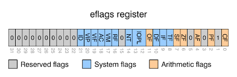

# Chapter 04.

CPU의 핵심 구성요소 ALU, 제어장치, 레지스터에 대해서 정리

### 레지스터

CPU 입장에서 메인메모리도 매우 느리다. 매번 연산마다 메모리에 접근하는 것은 CPU 실행 속도에 영향을 준다.
그래서 CPU는 연산에 필요한 정보를 항상 레지스터로 가져와 두고 사용하고, 연산 결과도 먼저 레지스터에 저장한다. 

**플래그**
- 연산 결과에 대한 추가적인 **상태 정보**
- 플래그 레지스터에 저장
- 말그대로 플래그 값으로 0이나 1의 값(1bit)으로 구분
- 종류
    - 부호 플래그(SF, Sign Flag)
    - 제로 플래그(ZF, Zero Flag)
    - 캐리 플래그(CF, Carry Flag)
    - 오버플로우 플래그(OF, Overflow Flag)
    - 인터럽트 플래그(IF, Interrupt Flag)
    - 슈퍼바이저 플래그(SF, Supervisor Flag)

 

### ALU

레지스터로부터 **피연산자를 받아**, 제어 신호에 따라 **연산을 수행한다.**

연산 결과는 레지스터에 저장하며, 결과와 더불어 **플래그**를 같이 저장한다.

 

### 제어장치

제어 신호를 내보내고, 명령어를 해석하는 부품이다. CPU 제조사마다 이 제어장치의 구현 방식이나 명령어 해석하는 방식이 조금씩 차이가 있다.

제어장치가 받아들이는 정보

1. 클럭 신호를 받는다.
2. ‘해석해야할 명령어’를 받는다.
3. 플래그 레지스터 속 플래그 값을 받는다.
4. 시스템 버스를 통해 전달되는 제어 신호를 받는다.

**클럭이란?**
컴퓨터의 모든 부품이 움직일 수 있게하는 시간 단위이다. 항상 모든 부품이 한 클럭 신호에 맞춰 한가지 동작을 하는건 아니다. 클럭이라는 신호 박자에 맞춰 동작할 뿐이다.
메모리에서 명령어를 가져오는건 오래 걸리기 때문에 여러 클럭 신호에 거쳐서 처리될 수 있다.
    
 
 

## 반드시 알아야 할 레지스터

많은 레지스터 중 중요한 여덟 개의 레지스터에 대해서만 정리한다.

### 1. 프로그램 카운터

다음 실행할 명령어의 주소를 기억하는 레지스터이다. CPU에 따라서 명령어 포인터라고 부르기도 한다.(EIP)
명령어가 실행이 되면서 자동으로 증가하면서 다음 명령어로 이동한다.

### 2. 명령어 레지스터

방금 메모리에서 읽어 들인 명령어를 저장하는 레지스터다. 제어장치가 이 레지스터의 명령어를 해석한 뒤 제어 신호를 보낸다.

### 3. 메모리 주소 레지스터

메모리 주소를 주정하는 레지스터로, CPU가 읽어 들이고자 하는 메모리 주소를 주소 버스로 보내기 전에 이 레지스터를 거친다.

### 4. 메모리 버퍼 레지스터

메모리에게 데이터를 전송하거나 메모리로부터 데이터를 전송 받을 때 거치게 되는 레지스터이다. 즉, 데이터 버스를 통해 메모리와 데이터를 주고받을 때 이 레지스터를 거치게 된다.

### 5. 플래그 레지스터

ALU 연산 결과에 따른 플래그나 CPU 상태에 대한 부가적인 정보를 저장하는 레지스터이다.

### 6. 범용 레지스터

CPU에서 다양하고 일반적인 상황에서 자유롭게 사용할 수 있는 레지스터이다. CPU에는 다수의 범용 레지스터가 있다.(EAX, EBX, ECX, EDX 등) 메모리 주소 레지스터와 메모리 버퍼 레지스터와 다르게 데이터와 주소 모두 저장될 수 있다. 

### 7. 스택 포인터(ESP)

주소 지정에 사용될 수 있는 특별한 레지스터이다. 스택 포인터는 메모리 상에 현재 작업 중인 스택 영역의 최상단 주소를 가르키는 레지스터로 스택 주소 지정 방식으로 사용된다.

### 8. 베이스 레지스터(EBP)

스택 포인터와 마찬가지로 주소 지정에 사용될 수 있는 특별한 레지스터이다. 현재 작업 중인 스택 영역의 기준 주소를 가르키는 레지스터로 변위 주소 지정 방식으로 사용된다.
스택 주소 지정 방식과 변위 주소 지정 방식은 메모리에 어떤 값을 접근하는지에 따라서 다르다. 스택 포인터를 기준으로 한다면 스택 주소 지정 방식이고, 베이스 레지스터나 프로그램 카운터를 기준으로 한다면 변위 주소 지정 방식이다. 프로그램 카운터를 기준으로 하는 경우는 주로 if 문과 비슷한 지점에서 코드를 실행할 때이다.

 
 

## 명령어 사이클과 인터럽트

하나의 명령어를 처리하는 정형화된 흐름을 명령 사이클이라고 한다.
이 사이클이 끊어지는 상황이 발생하면 이를 인터럽트라고 한다.

### 명령 사이클

- **인출 사이클**
    
    → CPU가 메모리에게 제어 신호와 주소 버스를 전송해서 데이터 버스로 명령어를 받아오는 일련의 과정을 말한다.
    
- **실행 사이클**
    
    → 가져온 명령어를 해석해서 실행하는 과정을 말한다.
    
- **간접 사이클**
    
    → 가져온 데이터가 간접 주소 지정 방식의 주소 값인 경우 다시 메모리로 해당 주소의 데이터를 요청해야 한다. 이렇게 메모리에 다시 추가적인 접근이 필요한 경우 실행하는 과정을 말한다.
    
- **인터럽트 사이클**

### 인터럽트

CPU가 수행 중인 작업을 방해하는? 신호를 말한다.

**인터럽트의 종류 두 가지**

- 동기 인터럽트
    - CPU에 의해 발생하는 인터럽트
    - 일반적으로 프로그램이 실행되면서 생기는 Exception
- 비동기 인터럽트
    - 외부에서 어떠한 이벤트에 의해 발생하는 인터럽트
    - 주로 입출력장치에 의해서 발생
    - 입출력 장치는 CPU에 비해서 느리기 때문에 해당 인터럽트를 비동기로 처리
    - 인터럽트 플래그가 활성화된 경우에 처리

**비동기 인터럽트의 처리 순서**

1. 하드웨어에서 CPU로 인터럽트 요청
2. CPU는 현재 실행 중인 사이클이 끝난 뒤 인터럽트 플래그를 확인
3. 인터럽트를 처리할 수 있는 상태라면 현재 CPU 레지스터의 정보를 메모리 스택 영역에 백업
4. 인터럽트에 대해서 인터럽트 벡터를 참조해서 인터럽트 서비스 루틴을 실행
    - 인터럽트 벡터: 인터럽트에 대한 서비스 루틴의 시작 주소를 알아내기 위해 사용한다.
    - 인터럽트 서비스 루틴: 발생한 언터럽트에 대한 처리 코드(OS 커널에 있다고 함)
5. 처리가 끝나면 다시 백업해 둔 정보를 레지스터로 복구